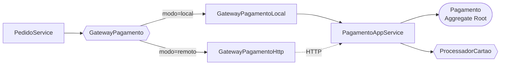

<div align="center">


# 💳 Pagamento Context · DDD & Refactoring

**Extração do contexto de Pagamento de um monólito de e-commerce, sem desligar o sistema**

<sub>DR4-TP1 · Bloco Engenharia de Softwares Escaláveis · Trabalho individual</sub>

<br/>

[](#-stack)
[](#-stack)
[](#-stack)
[](#-evidências)
[](#-a-estratégia)
[](LICENSE)

<br/>

[](docs/RELATORIO_TP1.md)

</div>

---

## 💡 Visão geral

Este repositório parte do monólito [`leoinfnet/ecommerce-legado-ddd`](https://github.com/leoinfnet/ecommerce-legado-ddd), propositalmente acoplado, e extrai dele o **Contexto Delimitado de Pagamento** aplicando DDD e o padrão **Branch by Abstraction**.

O contexto resultante **já poderia rodar em outro processo** — a troca é uma linha de configuração —, mas continua atendendo dentro do mesmo Spring Boot enquanto a migração não termina. É essa reversibilidade que torna a operação segura.

> **Disciplina:** Domain-Driven Design (DDD) e Arquitetura de Softwares Escaláveis com Java
> **Professor:** Leonardo Silva da Gloria · **Aluno:** André Luis Becker · Individual · 26E3

---

## 🌱 A estratégia

**Strangler Fig** como estratégia, **Branch by Abstraction** como mecanismo.

O Strangler Fig clássico intercepta chamadas na borda com um *proxy* HTTP. Aqui isso não se aplica: Pagamento não tem endpoint próprio e é chamado **de dentro**, por `PedidoService.criar()`. Não há requisição para desviar — então a abstração vai para dentro do monólito.



Trocar `local` por `remoto` move o pagamento para outro processo **sem alterar uma linha de `PedidoService`**. Os sete passos e os riscos assumidos estão no [relatório técnico](docs/RELATORIO_TP1.md#-questão-13--estratégia-de-migração).

---

## 🏗️ O contexto

| Peça | Papel |
|---|---|
| `Pagamento` | **Aggregate Root** — invariantes e transições de estado |
| `PagamentoId` · `Dinheiro` · `NumeroCartao` | **Value Objects** imutáveis e autovalidados |
| `StatusPagamento` · `FormaPagamento` · `MotivoRecusa` | **Enums** no lugar das strings soltas |
| `PagamentoRepositorio` · `ProcessadorCartao` | **Portas de saída** declaradas pelo domínio |
| `PagamentoAppService` | **Serviço de aplicação** — orquestra, não decide |
| `PagamentoRepositorioJpa` · `PagamentoJpaEntity` | **Adaptador JPA**, separado do agregado |
| `GatewayPagamento` + 2 *records* | **Contrato de integração** com Pedido |

A organização segue a arquitetura hexagonal que Richardson descreve no capítulo 5 de *Microservices Patterns*: a lógica de negócio no centro, adaptadores de entrada (REST) e de saída (JPA, processador de cartão) em volta.

Três regras sustentam a fronteira: o pacote `domain` é POJO puro, sem `import` de Spring ou JPA; outros agregados são referenciados por identidade (`long pedidoId`, nunca `Pedido pedido`) — a regra de Richardson para referências entre agregados; e o contrato trafega só primitivos.

> [!IMPORTANT]
> O contexto **não acessa** `UsuarioRepository`, `ProdutoRepository`, `EstoqueRepository` nem `PedidoRepository`. Não é convenção: o `FronteiraDoContextoTest` lê o código-fonte e quebra o build se acontecer.

---

## 💰 Regras de pagamento

As cinco regras do legado foram preservadas, divididas segundo quem é dono da decisão:

| Regra | Resultado | Decidida por |
|---|---|---|
| Valor menor ou igual a zero | `RECUSADO` · `VALOR_INVALIDO` | Agregado |
| Forma diferente de cartão | `RECUSADO` · `FORMA_PAGAMENTO_NAO_SUPORTADA` | Agregado |
| Valor acima de R$ 10.000,00 | `RECUSADO` · `LIMITE_EXCEDIDO` | Agregado |
| Cartão terminado em `0000` | `RECUSADO` · `CARTAO_BLOQUEADO` | Porta `ProcessadorCartao` |
| Cartão terminado em `1111` | `APROVADO` | Porta `ProcessadorCartao` |
| Demais cartões válidos | `APROVADO` | Porta `ProcessadorCartao` |
| Cartão ilegível | `RECUSADO` · `CARTAO_INVALIDO` | Fronteira do contexto |

A política é avaliada **antes** de qualquer chamada externa — não se gasta uma ida ao provedor para um pagamento que já se sabe recusado.

---

## 🧰 Stack

Java 25 · Maven · Spring Boot 4.1.0 · Spring Web (`RestClient`) · Spring Data JPA · H2 em memória · Bean Validation · JUnit 5

Padrões: DDD (Aggregate Root, Value Object, Bounded Context) · Ports & Adapters · Strangler Fig · Branch by Abstraction

---

## 🚀 Como executar

Requer **JDK 25** e **Maven 3.6.3+**.

```bash
mvn test
```

Dezessete testes: as cinco regras, o tratamento de cartão ilegível, as transições do agregado, a proteção dos Value Objects e as duas travas de fronteira.

```bash
mvn spring-boot:run
```

API em `http://localhost:8080`, console H2 em `/h2-console`. As credenciais do banco vêm de `DB_USERNAME` e `DB_PASSWORD`; sem variáveis definidas, valem os padrões do H2 em memória (`sa`, sem senha). Os dados iniciais são carregados na subida.

Para exercitar as regras, use [`requests.http`](requests.http) ou:

```bash
curl -X POST http://localhost:8080/pedidos -H "Content-Type: application/json" -d '{"usuarioId":1,"itens":[{"produtoId":1,"quantidade":1}],"formaPagamento":"CARTAO","numeroCartao":"4111111111111111"}'
```

Trocando o final do cartão para `0000`, a mesma chamada devolve `422` com `CARTAO_BLOQUEADO`.

> [!IMPORTANT]
> Não versione senhas, tokens, `.env` ou dados pessoais reais. Este projeto usa H2 em memória e não tem credencial versionada. Os números de cartão dos exemplos são valores de teste públicos.

### Modo remoto

Quando o contexto virar processo próprio, basta o `application.yml`:

```yaml
pagamento:
  modo: remoto
  url: http://localhost:8081
```

---

## 🔌 API

| Método | Rota | Resposta | Descrição |
|---|---|---|---|
| GET | `/usuarios` · `/produtos` · `/estoques` | `200` | Consultas do monólito |
| GET | `/pedidos` · `/pedidos/{id}` | `200` ou `404` | Lista e consulta pedidos |
| POST | `/pedidos` | `201` ou `422` | Cria o pedido e cobra pela abstração |
| POST | `/pagamentos` | `200` | Porta de entrada do contexto de Pagamento |

`POST /pagamentos` é o contrato que o adaptador HTTP consome no modo remoto — já publicado, para que a extração física não exija mudança de contrato.

```json
// POST /pagamentos
{"pedidoId": 99, "usuarioId": 1, "valor": 250.00, "formaPagamento": "CARTAO", "numeroCartao": "4111111111111111"}

// 200 OK
{"pagamentoId": "d757c423-…", "status": "APROVADO", "motivo": null, "codigoAutorizacao": "122D8125"}
```

---

## 📊 Evidências

```text
[INFO] Tests run: 17, Failures: 0, Errors: 0, Skipped: 0
[INFO] BUILD SUCCESS
```

Com a aplicação no ar: cartões `…1111` e `…4444` resultam em pedido `PAGO`; `…0000` devolve `422 CARTAO_BLOQUEADO`; um total de R$ 15.000 devolve `422 LIMITE_EXCEDIDO`; `valor: 0.00` devolve `VALOR_INVALIDO`; um cartão ilegível devolve `422 CARTAO_INVALIDO`; e R$ 10.000,00 exatos passam. O esquema gerado tem `pagamentos_ctx`, e a tabela `pagamentos` do legado deixou de existir.

---

## 🗂️ Estrutura

```text
.
├── docs/RELATORIO_TP1.md               ← Parte 2: estudo de caso e refatoração
├── src/main/java/br/edu/infnet/ecommerce/
│   ├── pagamento/                      ← CONTEXTO DELIMITADO
│   │   ├── domain/                     ← agregado, VOs, enums, portas (POJO puro)
│   │   ├── application/                ← serviço de aplicação
│   │   └── infrastructure/             ← JPA, processador de cartão, REST
│   ├── pedido/pagamento/               ← contrato de integração + 2 adaptadores
│   ├── response/                       ← DTOs de saída (API não expõe entidades JPA)
│   └── controller/ service/ entity/…   ← monólito remanescente
├── src/test/java/…/pagamento/          ← regras + trava de fronteira
├── requests.http
└── LICENSE                             ← código visível, direitos reservados
```

---

## 📄 Documentação

O detalhamento da Parte 2 — estratégia de migração, decisões de projeto e evidências — está em **[`docs/RELATORIO_TP1.md`](docs/RELATORIO_TP1.md)**.

As doze questões teóricas da Parte 1 fazem parte do documento de entrega, submetido em PDF diretamente ao professor e **não publicado neste repositório**.

---

## ⚖️ Licença e uso acadêmico

Código visível, **todos os direitos reservados** — veja [`LICENSE`](LICENSE).

Você pode ler, executar e aprender com este código, e citá-lo com atribuição. **Não** pode apresentá-lo como produção própria em qualquer avaliação, redistribuí-lo ou usá-lo comercialmente.

O projeto deriva de [`leoinfnet/ecommerce-legado-ddd`](https://github.com/leoinfnet/ecommerce-legado-ddd), de Leonardo Silva da Gloria, usado como base por orientação docente. Aquele projeto não declara licença, e os direitos sobre o código original permanecem com o seu autor.

> [!WARNING]
> Projeto didático. O processador de cartão é **simulado**, o banco é em memória e o código **não se destina a processar pagamentos reais**.

---

<div align="center">

<sub>Instituto Infnet · Escola Superior de Tecnologia da Informação · 2026</sub>


</div>
