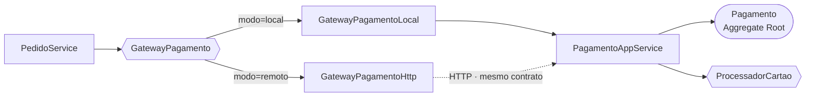

# Relatório Técnico · DR4-TP1

**Extração do contexto de Pagamento de um monólito de e-commerce**

> **Disciplina:** Domain-Driven Design (DDD) e Arquitetura de Softwares Escaláveis com Java
> **Bloco:** Engenharia de Softwares Escaláveis · **Professor:** Leonardo Silva da Gloria
> **Aluno:** André Luis Becker · Individual
> **Base:** [`leoinfnet/ecommerce-legado-ddd`](https://github.com/leoinfnet/ecommerce-legado-ddd)

Este documento cobre a **Parte 2** do TP1 — o estudo de caso e a refatoração. As doze questões teóricas da Parte 1 fazem parte do documento de entrega, submetido em PDF diretamente ao professor e não publicado neste repositório.

---

## 📚 Índice

1. [O ponto de partida](#-o-ponto-de-partida)
2. [Questão 13 · Estratégia de migração](#-questão-13--estratégia-de-migração)
3. [Questão 14 · A implementação](#-questão-14--a-implementação)
4. [Evidências de execução](#-evidências-de-execução)
5. [Cobertura do enunciado de apoio](#-cobertura-do-enunciado-de-apoio)
6. [Limites desta entrega](#-limites-desta-entrega)
7. [Referências](#-referências)

---

## 🧨 O ponto de partida

O monólito de origem é organizado **por camada técnica** — `controller/`, `service/`, `entity/`, `repository/` — com os defeitos plantados de propósito pelo professor.

Dois trechos resumem o problema. O `PedidoService` original alcançava o sistema inteiro:

```java
private final UsuarioRepository usuarioRepository;
private final ProdutoRepository produtoRepository;
private final EstoqueRepository estoqueRepository;
private final PedidoRepository pedidoRepository;
private final PagamentoRepository pagamentoRepository;
private final PagamentoService pagamentoService;
```

E a entidade `Pagamento` carregava o mapeamento objeto-relacional de outros dois contextos:

```java
@OneToOne  private Pedido pedido;
@ManyToOne private Usuario usuario;
```

Na classificação de acoplamento do capítulo 1 de *Monolith to Microservices*, isso é acoplamento de implementação — a forma que Newman chama de mais perniciosa, embora também uma das mais fáceis de reduzir. O banco compartilhado é o exemplo clássico que ele usa para ilustrá-la, e a recomendação é categórica: não compartilhe bancos e, se realmente precisar, faça o possível para evitar.

---

## 🌱 Questão 13 · Estratégia de migração

### Strangler Fig como estratégia

O padrão de referência para migração incremental é o **Strangler Fig**, descrito por Martin Fowler e adotado por Newman em *Monolith to Microservices* — livro em que, já no capítulo 1, ele se declara defensor de uma adoção gradual de microsserviços. A figueira estranguladora cresce em volta da árvore hospedeira até sustentar-se sozinha: o sistema novo cresce ao redor do monólito, assume uma funcionalidade por vez, e o monólito só é desligado quando não sobra nada dentro dele. O sistema antigo **continua no ar durante toda a transição**.

### Branch by Abstraction como mecanismo

A implementação clássica do Strangler Fig põe um *proxy* HTTP na frente do monólito e desvia rotas. Isso exige que a funcionalidade seja chamada **de fora**.

Não é o caso aqui: Pagamento não tem endpoint próprio no legado — é acionado **de dentro**, por `PedidoService.criar()`, numa chamada de método no mesmo processo. Não há requisição para interceptar.

Aplica-se então o **Branch by Abstraction** (padrão de Paul Hammant, documentado por Fowler): em vez de desviar tráfego na borda, cria-se uma abstração dentro do monólito e alternam-se implementações atrás dela.



### Os sete passos

| # | Passo | Efeito em produção |
|:--:|---|---|
| 1 | Criar `GatewayPagamento`, trafegando só IDs e primitivos | Nenhum — ninguém usa ainda |
| 2 | `PedidoService` passa a depender da abstração | Nenhum — comportamento idêntico |
| 3 | Construir o contexto com DDD, ao lado do legado | Nenhum — código novo, inativo |
| 4 | Alternar por `pagamento.modo`, começando por uma fatia | Reversível sem *deploy* |
| 5 | Rodar as duas em paralelo e comparar resultados | Divergências aparecem antes do cliente |
| 6 | Separar os dados e remover as FKs entre contextos | Migração isolada, sem risco de lógica |
| 7 | Remover a implementação antiga | Fecha o ciclo |

O passo 7 costuma ser o esquecido: Branch by Abstraction só termina quando a abstração deixa de ter duas implementações vivas para a mesma finalidade — caso contrário, a dívida técnica dobra em vez de diminuir.

### Por que Pagamento primeiro

Pagamento tem poucas dependências de entrada, regras bem delimitadas e fáceis de testar, e é o contexto em que a latência externa e os picos doem mais. É o critério que Newman propõe para ordenar a decomposição: começar pelo que é fácil de extrair e valioso de separar, para a equipe aprender o processo num caso de risco controlado.

### Risco assumido

O risco principal é a **consistência entre pedido e pagamento**. Enquanto a chamada for síncrona e no mesmo processo, o comportamento atual é preservado. Quando Pagamento virar processo separado, passa a existir a possibilidade de o pagamento ser aprovado e a confirmação não voltar. A evolução é tornar a operação idempotente e migrar para uma saga — etapa posterior, que não precisa estar resolvida para dar o primeiro passo.

---

## 🏗️ Questão 14 · A implementação

O contexto foi criado **dentro do mesmo projeto Spring Boot**, como pede o enunciado de apoio, mas com fronteira interna completa.

```text
br/edu/infnet/ecommerce/
├── pagamento/                       ← CONTEXTO DELIMITADO
│   ├── domain/                      ← POJO puro: agregado, VOs, enums, portas
│   ├── application/                 ← serviço de aplicação
│   └── infrastructure/              ← JPA, processador de cartão, REST
├── pedido/pagamento/                ← contrato de integração + 2 adaptadores
└── response/                        ← DTOs de saída da API
```

### O Aggregate Root

Concentra as regras que estavam espalhadas por três classes, não expõe *setters* e referencia Pedido e Usuário apenas por identidade — a segunda das três regras que Richardson estabelece para agregados (só a raiz é referenciável de fora; referências entre agregados usam chave primária; uma transação cria ou atualiza um agregado só).

As transições de estado impedem que um pagamento seja processado duas vezes, atendendo ao ponto que Newman levanta sobre agregados: um pedido externo de mudança de estado pode ser recusado, e o ideal é tornar transições ilegais impossíveis.

```java
public class Pagamento {

    private static final Dinheiro LIMITE_POR_TRANSACAO =
            Dinheiro.reais(new BigDecimal("10000.00"));

    private final PagamentoId id;
    private final long pedidoId;     // outro agregado: referência por identidade
    private final long usuarioId;    // outro agregado: referência por identidade
    private final Dinheiro valor;
    private final FormaPagamento forma;
    private StatusPagamento status;

    public static Pagamento solicitar(long pedidoId, long usuarioId, Dinheiro valor,
                                      FormaPagamento forma, NumeroCartao cartao) { … }

    /** Política do agregado, avaliada antes de qualquer integração externa. */
    public Optional<MotivoRecusa> violacaoDePolitica() {
        if (!valor.ehPositivo())                    return Optional.of(VALOR_INVALIDO);
        if (forma != FormaPagamento.CARTAO)         return Optional.of(FORMA_NAO_SUPORTADA);
        if (valor.maiorQue(LIMITE_POR_TRANSACAO))   return Optional.of(LIMITE_EXCEDIDO);
        return Optional.empty();
    }

    public void aprovar(String codigoAutorizacao) { exigirPendente(); … }
    public void recusar(MotivoRecusa motivo)      { exigirPendente(); … }
}
```

Arquivo completo: [`Pagamento.java`](../src/main/java/br/edu/infnet/ecommerce/pagamento/domain/Pagamento.java)

**Decisão de projeto.** O desenho segue os blocos de construção que Richardson lista no capítulo 5: `solicitar(...)` é uma *factory* implementada como método estático, `PagamentoRepositorio` é o repositório que encapsula o acesso ao banco, `Dinheiro` e `NumeroCartao` são objetos de valor — e a própria classe `Money`, com moeda e quantia, é o exemplo canônico que ele usa — e `PagamentoAppService` é o serviço que abriga a lógica que não pertence a uma entidade nem a um objeto de valor.

As cinco regras foram divididas segundo quem é dono de cada uma. Valor, forma e limite são política do negócio e ficam no agregado, avaliadas antes de qualquer chamada externa — não se gasta uma ida ao provedor para um pagamento que já se sabe recusado. Cartão bloqueado é decisão do provedor e fica no adaptador.

Um sexto caso vem do legado: número de cartão ilegível. Como o Value Object `NumeroCartao` só admite instâncias válidas, a fábrica `tentar(...)` devolve `Optional` vazio em vez de lançar, e o serviço registra um pagamento já recusado com `CARTAO_INVALIDO`. Assim o invariante do objeto de valor é preservado **e** o comportamento original — recusa de negócio auditável, não erro técnico — se mantém.

O pacote `domain` não tem nenhum `import` de Spring ou de JPA. É o que permite mover o contexto para outro processo sem reescrever o domínio, e o que torna as regras testáveis sem subir a aplicação.

### O contrato de integração

Uma interface e dois *records* com apenas identificadores e primitivos. Nenhuma classe do contexto de Pagamento aparece na assinatura vista pelo monólito.

```java
public interface GatewayPagamento {
    ResultadoPagamento cobrar(SolicitacaoPagamento solicitacao);
}

public record SolicitacaoPagamento(Long pedidoId, Long usuarioId, BigDecimal valor,
                                   String formaPagamento, String numeroCartao) { }

public record ResultadoPagamento(String pagamentoId, String status,
                                 String motivo, String codigoAutorizacao) {
    public boolean aprovado() { return "APROVADO".equals(status); }
}
```

Duas implementações convivem, escolhidas por `@ConditionalOnProperty`:

| `pagamento.modo` | Implementação | Como chama |
|---|---|---|
| `local` (padrão) | `GatewayPagamentoLocal` | delega ao serviço de aplicação, mesmo processo |
| `remoto` | `GatewayPagamentoHttp` | `POST /pagamentos` via `RestClient` |

`PedidoService` não muda entre um modo e outro. É esse o ponto do Branch by Abstraction: a extração física deixa de ser um evento arriscado e vira mudança de configuração.

Arquivos: [`pedido/pagamento/`](../src/main/java/br/edu/infnet/ecommerce/pedido/pagamento/)

### Persistência

A interface `PagamentoRepositorio` fala a linguagem do domínio e trabalha com o agregado; o adaptador JPA tem entidade própria (`pagamentos_ctx`), com `pedido_id` e `usuario_id` como colunas simples — sem `@ManyToOne`, sem FK para outros contextos. É o que torna a separação física do banco, no passo 6, uma migração trivial.

Como o identificador é atribuído pelo domínio (`UUID`) e não gerado pelo banco, a entidade implementa `Persistable`. Sem isso, o Spring Data trataria toda instância como já existente e faria um `SELECT` antes de cada `INSERT`. O agregado só é persistido uma vez — ele recusa ser processado duas vezes —, então declarar a instância como nova é correto.

### Higiene aplicada ao monólito remanescente

Três correções que não fazem parte da extração, mas que a acompanham:

| Antes | Depois | Por quê |
|---|---|---|
| `spring.jpa.open-in-view: true` | `false`, com DTOs de saída | A sessão do Hibernate deixa de sobreviver à camada web, e a API para de serializar entidades JPA — o contrato deixa de depender do mapeamento |
| `PedidoRepository.findAll()` | consultas com `join fetch` | Montar a resposta disparava uma consulta por pedido para carregar os itens: o problema N+1 |
| Credenciais literais no `application.yml` | `${DB_USERNAME:sa}` e `${DB_PASSWORD:}` | Nenhuma credencial no código; ao trocar por um banco real, define-se no ambiente |

Também foi desligado o log `org.hibernate.orm.jdbc.bind: TRACE`, herdado do projeto de origem. Ele registra todo parâmetro enviado ao JDBC — num contexto de pagamento, é por esse caminho que dado de cartão vaza para o log.

---

## ✅ Evidências de execução

```
mvn test
```

```text
[INFO] Tests run: 17, Failures: 0, Errors: 0, Skipped: 0
[INFO] BUILD SUCCESS
```

O `FronteiraDoContextoTest` lê o próprio código-fonte e **falha** se alguém injetar de volta um dos quatro repositórios proibidos, ou se o pacote `domain` passar a importar Spring ou JPA.

As cinco regras, com a aplicação no ar:

| Regra | Requisição | Observado |
|---|---|---|
| Valor ≤ zero: recusado | `POST /pagamentos` `valor: 0.00` | `RECUSADO` · `VALOR_INVALIDO` |
| Acima de R$ 10.000,00: recusado | `POST /pedidos` R$ 15.000 | `422` · `LIMITE_EXCEDIDO` |
| Cartão `…0000`: bloqueado | `POST /pedidos` | `422` · `CARTAO_BLOQUEADO` |
| Cartão `…1111`: aprovado | `POST /pedidos` | `201` · pedido `PAGO` |
| Demais válidos: aprovados | `POST /pedidos` `…4444` | `201` · pedido `PAGO` |
| Cartão ilegível: recusa de negócio | `POST /pedidos` `123` | `422` · `CARTAO_INVALIDO` |

R$ 10.000,00 exatos continuam aprovados. O esquema gerado confirma a separação: existe `pagamentos_ctx` e a tabela `pagamentos` do legado deixou de existir.

---

## 🔍 Cobertura do enunciado de apoio

| Problema apontado | Como ficou |
|---|---|
| Organização só por camadas técnicas | `domain` / `application` / `infrastructure` |
| Entidades JPA compartilhadas | `PagamentoJpaEntity` exclusiva e separada do agregado |
| `PedidoService` com vários repositórios | Saiu `PagamentoRepository`; sobrou uma abstração |
| Pagamento conhecendo Pedido e Usuário | `long pedidoId` e `long usuarioId` |
| Regras espalhadas | Política no agregado, autorização na porta |
| Strings para status e forma | `StatusPagamento`, `FormaPagamento`, `MotivoRecusa` |
| Sem Aggregate Root, VOs e integração | `Pagamento`; `PagamentoId`, `Dinheiro`, `NumeroCartao`; `GatewayPagamento` |
| Processador concreto | Porta `ProcessadorCartao` + adaptador |

Verificado por teste: o contexto não acessa `UsuarioRepository`, `ProdutoRepository`, `EstoqueRepository` nem `PedidoRepository`.

---

## ⚠️ Limites desta entrega

- **O banco ainda é o mesmo.** `pagamentos_ctx` convive com as tabelas do monólito. A separação física é o passo 6 e depende de o contexto já estar atendendo — mas não há FK a remover.
- **A transação ainda é única.** `PedidoService.criar()` continua `@Transactional` cobrindo estoque e pagamento. No modo `remoto` isso deixa de valer e o fluxo precisa virar saga com compensação de estoque.
- **Não há idempotência.** Um *retry* do adaptador HTTP geraria um segundo pagamento. Chave de idempotência por `pedidoId` é o primeiro item da próxima iteração.
- **O processador é simulado**, como no enunciado — agora atrás de uma porta.
- **A baixa de estoque continua antes do pagamento**, como no legado: problema real, fora do escopo desta extração.
- **O formato do cartão é mais rigoroso que o do legado.** O original recusava apenas números com menos de 4 caracteres, sem exigir dígitos — o que aprovava entradas como `"abcd"` como cartão válido. O Value Object `NumeroCartao` exige de 13 a 19 dígitos, a faixa real de um PAN. A recusa continua sendo de negócio (`CARTAO_INVALIDO`), como no legado; o que mudou foi o critério de validade. Reproduzir o comportamento original significaria reproduzir um defeito.

---

## 📖 Referências

- EVANS, Eric. **Domain-Driven Design: Tackling Complexity in the Heart of Software**. Boston: Addison-Wesley, 2003.
- FOWLER, Martin. **BranchByAbstraction**. martinfowler.com, 2014. <https://martinfowler.com/bliki/BranchByAbstraction.html>
- FOWLER, Martin. **StranglerFigApplication**. martinfowler.com, 2004. <https://martinfowler.com/bliki/StranglerFigApplication.html>
- GLORIA, Leonardo Silva da. **ecommerce-legado-ddd**. GitHub, 2026. <https://github.com/leoinfnet/ecommerce-legado-ddd>
- NEWMAN, Sam. **Monolith to Microservices**. Sebastopol: O'Reilly Media, 2019. Cap. 1: *Just Enough Microservices*. <https://learning.oreilly.com/library/view/monolith-to-microservices/9781492047834/ch01.html>
- RICHARDSON, Chris. **Microservices Patterns: With Examples in Java**. Shelter Island: Manning, 2018. Cap. 5: *Designing business logic in a microservice architecture*. <https://learning.oreilly.com/library/view/microservices-patterns/9781617294549/OEBPS/Text/05.html>
- SPRING. **REST Clients — Spring Framework Reference Documentation**. <https://docs.spring.io/spring-framework/reference/integration/rest-clients.html>
- VERNON, Vaughn. **Effective Aggregate Design**. dddcommunity.org, 2011. <https://www.dddcommunity.org/library/vernon_2011/>
